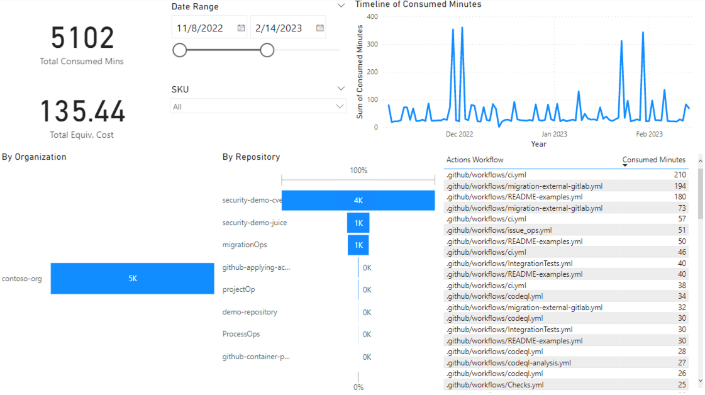
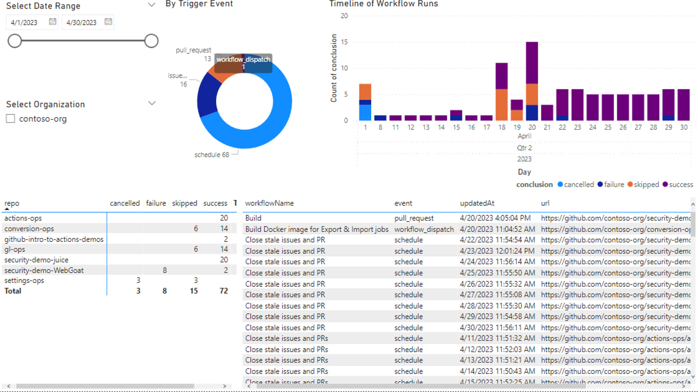

# Reportings for GitHub.com

These are proof of concepts for reporting GitHub data. They are not production ready. You can use them as a starting point to build your own reporting.

GitHub has [GraphQL](https://docs.github.com/en/graphql) and [REST API](https://docs.github.com/en/rest) to allow retrieving data for your organizations and repositories.

## Dashboard for Actions usage

This dashboard is to aid monitoring Actions usage spikes. It visualizes the usage of GitHub Actions by organization, repository, workflow and date range.

Data source 
- **Get usage report** directly from [organization](https://docs.github.com/en/enterprise-cloud@latest/billing/managing-billing-for-github-actions/viewing-your-github-actions-usage#viewing-github-actions-usage-for-your-organization) or [enterprise account](https://docs.github.com/en/enterprise-cloud@latest/billing/managing-billing-for-github-actions/viewing-your-github-actions-usage#viewing-github-actions-usage-for-your-enterprise-account)
- [Connect to the data source to PowerBI report](https://learn.microsoft.com/en-us/power-bi/connect-data/desktop-data-sources)
- Power Query filters the data for `Actions` product data only.

Visualizer tool
- [PowerBI Desktop](https://powerbi.microsoft.com/en-us/downloads/).

Artifact file(s)
- [github-usage-dashboard.pbit](github-usage-dashboard.pbit)

## Dashboard for Workflow Runs

This dashboard is to aid monitoring workflow runs failure. It visualizes the conclusions of GitHub workflow runs by organization, repository, workflow and date range.

Data source

- Execute `get-workflow-runs-by-org.sh` with read access permission to the selected scope. It should return `workflow-runs.json` file. Tip: `chomod +x get-workflow-runs-by-org.sh` to make it executable on CLI.
- [Connect to the data source to PowerBI report](https://learn.microsoft.com/en-us/power-bi/connect-data/desktop-data-sources)

Visualizer tool

- [PowerBI Desktop](https://powerbi.microsoft.com/en-us/downloads/)

Artifact file(s)

- [get-workflow-runs-by-org.sh](./scripts/get-workflow-runs-by-org.sh)
- [github-workflow-runs-dashboard.pbit](github-workflow-runs-dashboard.pbit)
