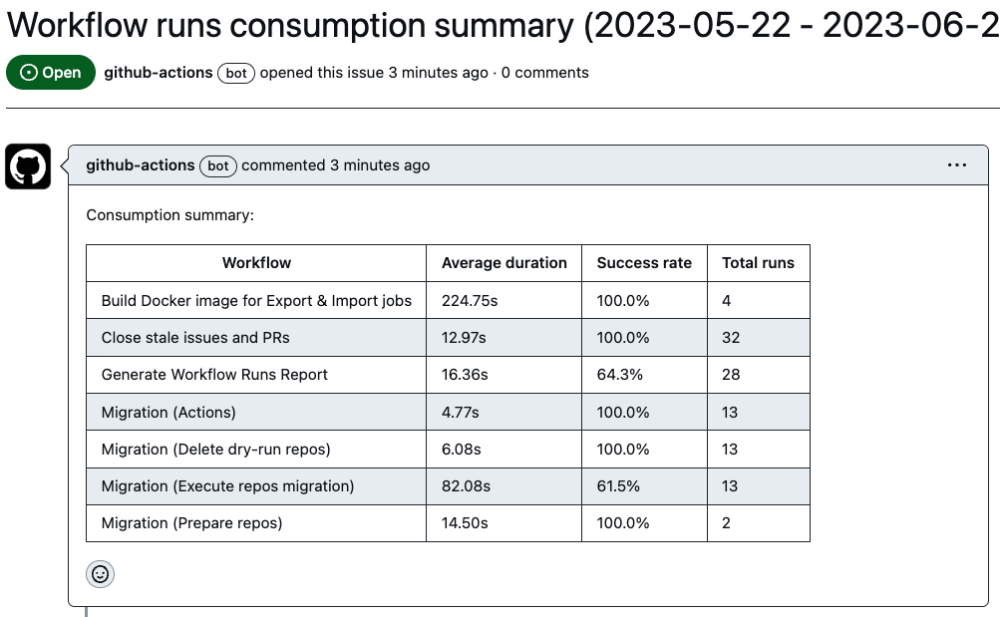
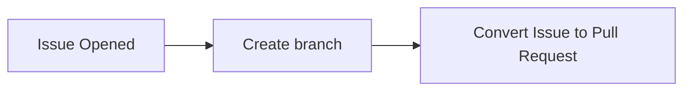

# Workflow for GitHub.com

These are proof of concepts for automation using Actions. They are not production ready. You can use them as a starting point to build your own.

GitHub [Actions documentation](https://docs.github.com/en/actions) has a rich set of articles from Getting Started to referenced librarys for Actions context.

## `evaluate-workflow-usage.yml`

This workflow is to generate a summary of workflow runs within the hosted repository with the given date period. The summary is represented in both Value Stream view and Table view.

#### Sample report

#### How to use
- Create a `yml` workflow under `.github/workflows/` folder
- Set the desired `on` trigger

#### Expected outcomes
- An Issue will be created with the formatted data

#### Variations
- `START_DATE` and `END_DATE` in `step: Set dates` - They are set to one month apart. This can be modified to the desired duration.
- Templates in `step: Create Mermaid diagram template` and `step: Create Table template` - This can be removed if using predefined markdown templates (e.g. defining styles for mermaid diagram) If this is the case, update `step: Format calculated result with templates` to use the predefined template.

## `create-pr-on-new-issue.yml`

This workflow attempts to orchestrate the beginning of [GitHub Flow](https://docs.github.com/en/get-started/quickstart/github-flow).

#### Flowchart

#### How to use
- Create a `yml` workflow under `.github/workflows/` folder

#### Expected outcomes
- When a new issue is created, a new branch and a pull request are automatically created.