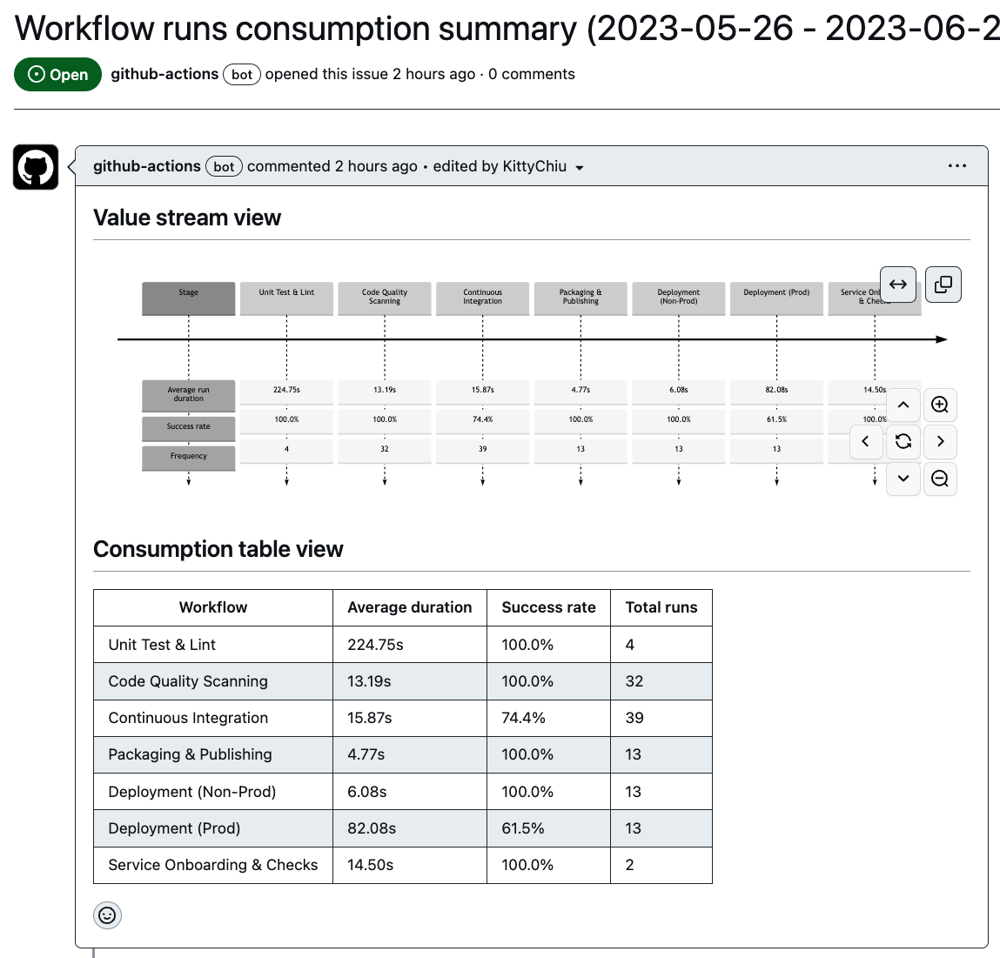

# Workflow for GitHub.com

These are proof of concepts for automation using Actions. They are not production ready. You can use them as a starting point to build your own.

GitHub [Actions documentation](powerbi/README.md) has a rich set of articles from Getting Started to referenced librarys for Actions context.

## `evaluate-workflow-usage.yml`

This workflow is to generate a summary of workflow runs within the hosted repository with the given date period.

#### Sample report

#### How to use
- Create a `yml` workflow under `.github/workflows/` folder
- Set the desired `on` trigger

#### Expected outcomes
- An Issue will be created with the report data

#### Variation
- Current duration between START_DATE and END_DATE is set to one month. Change to desired duration.